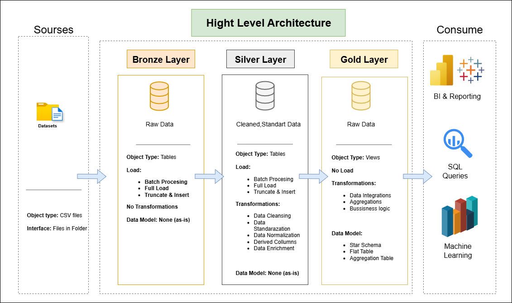

# Data Warehouse and Analytics Project

Welcome to the **Data Warehouse and Analytics Project** repository!
This project demonstrates a comprehensive data warehousing and analytics solution, from building a data warehouse to generating actionable insights. Designed as a portfolio project, it highlights industry best practices in data engineering and analytics. Also this project consist two reports: product report and customer report. These scripts cover various analyses such as database exploration, measures and metrics, time-based trends, cumulative analytics, segmentation, and more.
---
## 🏗️ Data Architecture

The data architecture for this project follows Medallion Architecture **Bronze**, **Silver**, and **Gold** layers:


1. **Bronze Layer**: Stores raw data as-is from the source systems. Data is ingested from CSV Files into SQL Server Database.
2. **Silver Layer**: This layer includes data cleansing, standardization, and normalization processes to prepare data for analysis.
3. **Gold Layer**: Houses business-ready data modeled into a star schema required for reporting and analytics.

---
## Project Overview

This project involves:

1. **Data Architecture**: Designing a Modern Data Warehouse Using Medallion Architecture **Bronze**, **Silver**, and **Gold** layers.
2. **ETL Pipelines**: Extracting, transforming, and loading data from source systems into the warehouse.
3. **Data Modeling**: Developing fact and dimension tables optimized for analytical queries.
4. **Analytics & Reporting**: Creating SQL-based reports and dashboards for actionable insights.
5. **Analysis**: Examination of the received data model to extract insights and present summarized conclusions.

---

##  Project Requirements

### Building the Data Warehouse (Data Engineering)

#### Objective
Develop a modern data warehouse using SQL Server to consolidate sales data, enabling analytical reporting and informed decision-making.

#### Specifications
- **Data Sources**: Import data from source provided as CSV files.
- **Data Quality**: Cleanse and resolve data quality issues prior to analysis.
- **Integration**: Combine both sources into a single, user-friendly data model designed for analytical queries.
- **Scope**: Focus on the latest dataset only; historization of data is not required.
- **Documentation**: Provide clear documentation of the data model to support both business stakeholders and analytics teams.
---

### BI: Analytics & Reporting (Data Analysis)

#### Objective
Develop SQL-based analytics to deliver detailed insights into:
- **Customer Behavior**
- **Product Performance**
- **Sales Trends**

These insights empower stakeholders with key business metrics, enabling strategic decision-making.  

For more details, refer to [docs/requirements.md](docs/requirements.md).

## Repository Structure
```
data-warehouse-project/
│
├── datasets/                           # Raw datasets used for the project (Customer, Product, Sales)
│
├── docs/                               # Project documentation and architecture details│
│   ├── data_catalog.md                 # Catalog of datasets, including field descriptions and metadata
│   ├── data_flow.png               # PNG file for the data flow diagram
│   ├── data_models.png              # PNG file for data models (star schema)
│
├── scripts/                            # SQL scripts for ETL and transformations
│   ├── bronze/                         # Scripts for extracting and loading raw data
│   ├── silver/                         # Scripts for cleaning and transforming data
│   ├── gold/                           # Scripts for creating analytical models
│	├── SQL_reports/
├── README.md                           # Project overview and instructions└── requirements.txt                    # Dependencies and requirements for the project
```
---

## About Me

Hi there! I'm Sher-Ali Penza. I’m a student at Lviv University in the field of Mathematics and Statistics, and I am also interested in data analysis.

I would be glad to receive feedback on my project. You can contact me at [penza121sher@gmail.com].
